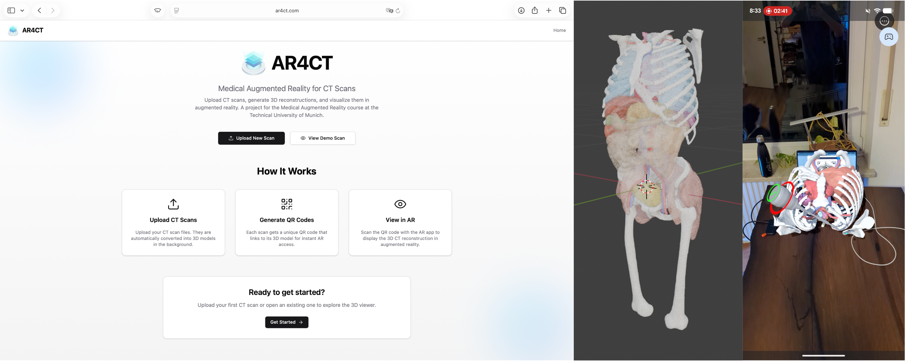
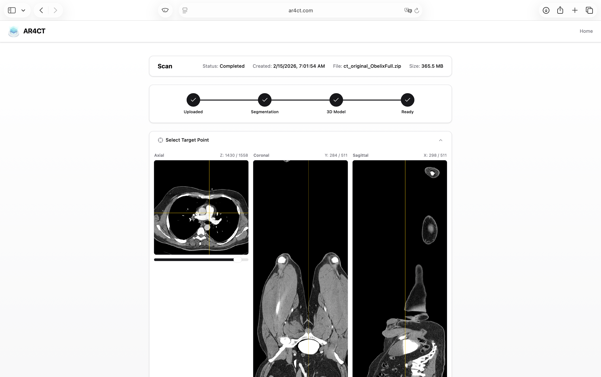
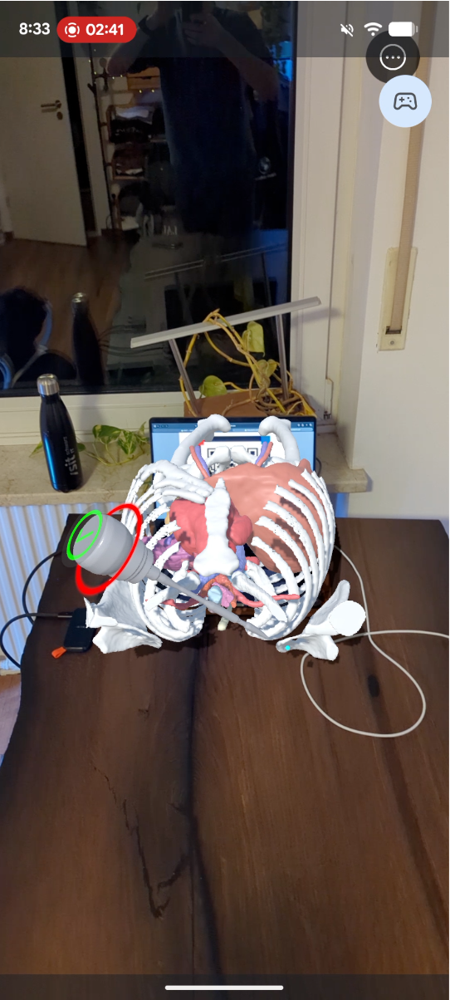

# AR4CT 

> Medical Augmented Reality — Technical University of Munich

A voluntary project for the course **Medical Augmented Reality** at TUM by Prof. Nassir Navab.

AR4CT bridges CT imaging and augmented reality: upload a CT scan, automatically segment it into 3D organ models, then visualise the result in AR on a mobile device.

**🌐 Try it live at [ar4ct.com](https://ar4ct.com)**



---

## Overview

The project consists of three components:

| Component | Description | Tech |
|-----------|-------------|------|
| **[Web App](WebApp/)** | Upload CT scans, trigger segmentation, annotate, print QR codes | React 19, FastAPI, Docker |
| **[AR App](ARMobileApplication/)** | Scan QR code → display 3D model in AR, track a tool marker | Unity, AR Foundation, TriLib |
| **[TotalSegmentator Worker](WebApp/totalsegmentator/)** | GPU-based CT segmentation (serverless) | PyTorch, RunPod, TotalSegmentator |

---

## How It Works

```
                          ┌──────────────────────┐
  Upload CT scan     ───► │  Web App (FastAPI)   │
  (.zip / .nii / .mhd)    └──────┬───────────────┘
                                 │  auto-submit
                                 ▼
                          ┌───────────────────────┐
                          │  RunPod GPU Worker    │
                          │  TotalSegmentator     │
                          │  NIfTI → STL per organ│
                          └──────┬────────────────┘
                                 │  callback
                                 ▼
                          ┌───────────────────────┐
                          │  Blender (headless)   │
                          │  STL → coloured FBX   │
                          └──────┬────────────────┘
                                 │
                                 ▼
                          ┌───────────────────────┐
  Print QR + tool    ◄─── │  Web App              │
  marker PDF              │  CT viewer, annotate  │
                          └──────┬────────────────┘
                                 │  deep link
                                 ▼
                          ┌───────────────────────┐
  Scan QR in AR      ───► │  Unity AR App         │
  See 3D model            │  Tool tracking +      │
  Track tool distance     │  distance feedback    │
                          └───────────────────────┘
```

1. **Upload** a CT scan via the web app
2. **Segmentation** runs automatically on a RunPod GPU (117 organs + body surface)
3. **Post-processing** converts STL meshes to a single coloured FBX via Blender
4. **Annotate** a target point on a 2D CT slice viewer
5. **Print** a PDF with a QR code and a tool tracking marker
6. **Scan** the QR code with the AR app — the 3D model appears on top
7. **Track** a physical tool marker and see real-time distance to the annotation point

---

## Web App



- **CT Viewer** — Browse axial / sagittal / coronal slices with windowing controls
- **Point Annotation** — Click on a CT slice to set a target point (transformed to 3D model space)
- **QR Code** — Distinctive coloured-corner QR for robust AR tracking
- **Printable PDF** — A4 page with a 15 cm QR code and 5 cm tool marker

See [WebApp/README.md](WebApp/README.md) for setup instructions.

---

## AR App (Unity)



> **Want to try it?** Download the debug APK directly:  
> [⬇ Download AR4CT.apk](https://github.com/simongraeber/AR4CT/releases/latest/download/AR4CT.apk)  
> Or build it yourself from the Unity project below.

- **Deep Link** — Open `ar4ct.com/app/{scanId}` on a mobile device to launch the AR app
- **Image Tracking** — Tracks the printed QR code and the tool marker simultaneously
- **3D Visualisation** — FBX model loaded at runtime via TriLib, placed on the QR code
- **Tool Distance** — Colour gradient (green → red) showing distance to the annotation point, with audio feedback on arrival

The Unity project is in [`ARMobileApplication/`](ARMobileApplication/).

---

## Getting Started

### Prerequisites

- **Docker** and **Docker Compose** (for the web app)
- **Unity 6** with AR Foundation (for the AR app)
- A **RunPod** account with a serverless endpoint (for GPU segmentation) — or upload pre-made FBX files directly

### Quick Start (Web App — Development)

```bash
cd WebApp
docker compose up --build
```

This starts:
- **Client** at `http://localhost:5173` (React + Vite, hot-reload)
- **Server** at `http://localhost:8000` (FastAPI + Blender, hot-reload)

> **Note:** Without RunPod credentials, CT segmentation won't work. You can still upload FBX files directly.

### Environment Variables

The server reads these from the environment (set in `docker-compose.yml` or a `.env` file):

| Variable | Description | Default |
|----------|-------------|---------|
| `RUNPOD_API_KEY` | RunPod API key for segmentation | _(empty)_ |
| `RUNPOD_ENDPOINT_ID` | RunPod serverless endpoint ID | _(empty)_ |
| `API_BASE_URL` | Public API URL (for RunPod callbacks) | `https://api.ar4ct.com` |
| `PUBLIC_BASE_URL` | Public URL used in QR codes | `https://ar4ct.com` |

---

## Project Structure

```
AR4CT/
├── Images/                  # Logo assets
├── ARMobileApplication/     # Unity AR app
│   └── Assets/CT4AR/        # Custom C# scripts
├── WebApp/
│   ├── docker-compose.yml   # Development compose
│   ├── client/              # React 19 + Vite + TailwindCSS
│   ├── server/              # FastAPI + Blender (headless)
│   │   ├── app/routes/      # API endpoints
│   │   ├── app/services/    # RunPod integration
│   │   └── app/scripts/     # STL → FBX conversion
│   └── totalsegmentator/    # RunPod serverless worker
└── README.md
```

