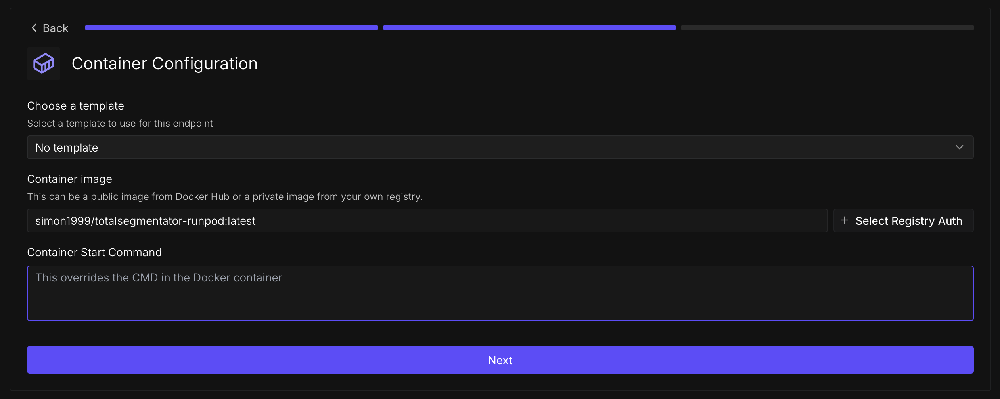

# TotalSegmentator on RunPod

Runs [TotalSegmentator](https://github.com/wasserth/TotalSegmentator) as a serverless GPU worker on [RunPod.io](https://runpod.io/) for cost-effective CT segmentation.

## What It Does

The handler receives a CT scan URL, runs TotalSegmentator to produce NIfTI segmentation masks for 117 organ classes, converts each mask to an STL mesh via marching cubes, and uploads the STL files back to the AR4CT server via a callback URL. It also generates a "body" surface mesh by thresholding at -500 HU.

## Docker Image

The Docker image used for deployment:
- [Docker Hub: simon1999/totalsegmentator-runpod](https://hub.docker.com/repository/docker/simon1999/totalsegmentator-runpod)

### Build and Push

The image includes PyTorch 2.4 + CUDA 12.4 + TotalSegmentator and can take several minutes to build:

```bash
docker build --platform linux/amd64 -t simon1999/totalsegmentator-runpod:latest .
docker push simon1999/totalsegmentator-runpod:latest
```

## RunPod Setup

Create a serverless endpoint on RunPod with:

- **GPU configuration:** 16 GB VRAM
- **Container Disk:** 20 GB
- **Container image:** `simon1999/totalsegmentator-runpod:latest`



Set the resulting endpoint ID and your RunPod API key as environment variables on the AR4CT server (`RUNPOD_ENDPOINT_ID`, `RUNPOD_API_KEY`).

## Testing

```bash
export RUNPOD_API_KEY="your_key"
export RUNPOD_ENDPOINT_ID="your_endpoint_id"
python test_endpoint.py
```

---

For more details on TotalSegmentator itself, see the [TotalSegmentator GitHub repository](https://github.com/wasserth/TotalSegmentator).